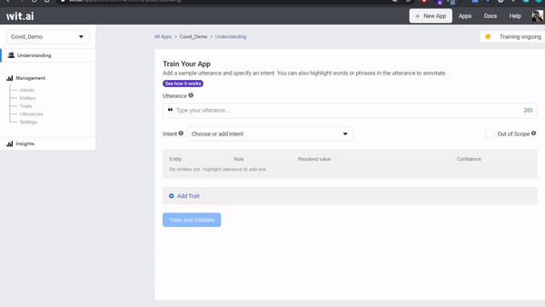

## Overview
<p align="center">
  
</p>

If you want to see docusaurus version, you could visit https://covidcenter.github.io/docs/

In this tutorial, we will be creating an API-based bot that give information covid to your account. The app will be able to process the user's text and respond to the user data about covid that they want. The key things we will explore is how to:

*   [Design the user interaction and Architecture](#design-the-user-interaction)
*   [Understand Terms in Wit.AI](#understand-terms-in-Wit.AI)
*   [Create and Training your Wit app to do natural language processing (NLP)](#create-and-training-your-wit-app-to-do-natural-language-processing-(NLP))
*   [Integrate Wit with your Messenger Bot](#integrate-wit-with-your-messenger-bot)

## Prerequisites

*   Create a [Wit.ai](https://wit.ai/) account
*   Clone this repository [Wit.ai Covid Center Demo](https://github.com/imamaris/covidcenter-bot) from GitHub
*   Create Facebook Page | [Link](https://www.facebook.com/pages/create)
*   Create Facebook App | [Tutorial](https://developers.facebook.com/docs/apps/)
*   Download & Install Ngrok [Link](https://ngrok.com/download)

Ngrok is reverse proxy, it allow you deploy at local with random link.

## Design the User Interaction

When designing applications with interactions, it's important to understand the various ways that a user may interact with your app. Some techniques that can help with modeling the conversation is writing a script or creating a flow diagram. For our covid app, let's write a script to outline it.


Let's consider the following conversation as the happy path:
```
User: "Good morning, what is this bot for?"

Wit:  "Sorry, Cocid doesn't understand :(. If you want to know the latest covid info, please type "total covid in your city". Example: total covid in Jakarta"

User: "Total covid in Jakarta"

Wit:  "total covid in jakarta is 10 case, 1 confirmed, 9 deaths.\n
If you experience the following symptoms, your sense of taste disappears, difficulty breathing, high fever, dry cough, fatigue, immediately do further checks at the referral hospital and after doing the test, if positive it is recommended to do self-quarantine for 14 days at your home. \n\n the following article on how to self quarantine
good and true according to WHO (World Heart Organization) :

https://www.who.int/indonesia/news/novel-coronavirus/new-infographics/self-quarantine

This is referral hospitals in Jakarta :\n
1. rumah sakit Umum Fatmawati (https://goo.gl/maps/GV6fZRxhEgg2PPjK7)\n
2. rumah sakit Jakarta Medical Centre (https://goo.gl/maps/oPnpyw2edFJcg3ha7)\n
3. rumah sakit Umum Andhika (https://g.page/rsuandhika?share)`?"

User: "Alhamdulillah" / (send a location)

Wit: "Great, if you feel good !! keep physical distancing yaaa :D"

```

There are many other scenarios to consider as well, but for the tutorial let's just focus on these.

## Understand Terms in Wit.AI

Before we train our Wit app, we should learn about intents, entities, traits, and utterances.
If you already learn those terms, you can go to [Next section](#training-your-wit-app-to-do-natural-language-processing-nlp)

Case Study:
We want to understand what our end-user wants to perform. For example:

- Ask about the weather
- Book a restaurant
- Open the garage door

The problem is that there a millions of different ways to express a given intent. For instance, all the following expressions should be mapped to the same intent:

"What is the weather in Paris?"
"Give me tomorrow weather in Paris."
"Is it sunny or rainy in Paris now?"

**Those expressions are** asking about the **weather intent**. How about entities ? 
**Entities is object that referred in the intent of sentence**.

"What is the weather in **Paris** ?"
Paris is **city** where we ask about the weather for.

"Give me **tomorrow** weather in **Paris**."
Tomorrow is **time** when we ask about the weather for.

"Is it **sunny** or **rainy** in **Paris** **now**?"
And **sunny** and **rainy** are options what we ask about he weather.

**The entities make machine understand what object that related with the intent**.
example: "Give me **tomorrow** weather in **Paris**."

Intent: Ask about the weather , Entities: City: Paris Time: Tomorrow
Machine could query to the database in table weather(intent) with paris city and tomorrow queries (entities)

So what is trait ?
**Trait is tendency of an intent**.
We could give an example of this like sentiment on reaction_intent.

"Sad" (negative)
"OMG :(" (negative)
"I can't believe this. I'm crying" (negative)
"Superb" (positive)

**Utterances is sample data which define a sentence to be categorized to an intent and have entities and traits**.
This term will be used to train data, for example: 


Now that we are understand, let’s train our Wit app to process the user’s response to the app.

## Create and Training your Wit app to do natural language processing (NLP)

Wit AI has **two method for training the NLP**.
The first is inserting utterances with **web interface**.
The second one is inserting utterances with **API**.

We would like to introduce to you all for two methods. But, because data is supossed to be large,
we emphasize the API method more than Web Interface method in this tutorial.

### Wit AI Web Interface

We are going to create intents to define what the user's utterance for our wit.AI application will understand. On the dashboard click on intents, click **+Intents** to add a new intents.

<p align="center">

</p>

How to produce sentiment

1. Select Understanding from the left nav and add a sentence you want to do sentiment analysis on.
```
This is amazing!
```
2. Click **Add Trait**. Enter the name of the trait, such as "sentiment".
3. Click the value selector to create a value "positive".
4. Validate your sentence.
5. Select **Traits** from the left nav and select the trait you just created.
6. In the values section, add more values such as "negative" and "neutral".
7. Annotate a few more examples to get more accurate results!

<p align="center">

</p>

Update: for English apps, you can use our wit/sentiment built-in! It should already appear in your traits dropdown when you click Add Trait.

Your **"sentiment"** is a trait, which means that it depends on the utterance as a whole (as opposed to a particular word or sequence of words appearing in the sentence). If it is inferred from a keyword or a specific phrase, use an entity instead. Your "sentiment" trait is trained by and for you. The good news is, it will be completely **customized to your case**. The bad news is, you need to provide several examples for each value :).

For more information on this, see the [Quick Start](https://wit.ai/docs/quickstart) guide.

### Wit AI API

Before we implement, we should read [Wit.AI API Documentation](https://wit.ai/docs/http/20200513/) first.

After we understand the API, open the [Wit.ai Covid Center init data script](https://github.com/imamaris/covidcenter-bot/tree/init-data)

Update the `init-data/sentiment.tsv` and add
```tsv
Alhamdulillah    sentiment   positive
Bad News   sentiment   negative
Not Good   sentiment   negative
I am so sad   sentiment   negative
Huhuhuhu   sentiment   negative
```

Get Your Seed Token


In order to start using the Wit.ai API, we need to start with some identification. Make sure you have signed up for [Wit.ai](https://wit.ai) if you haven't already.

Once you have:

1. Go to the `Settings` page of the [Wit console](https://wit.ai/home)
2. Copy the `Server Access Token`


This will be the base token we will use to create other apps. In the code this will be under the variable `NEW_ACCESS_TOKEN`.

Next update `NEW_ACCESS_TOKEN` and `APP_ID` in `shared.js` variable to run the  as follows:

```js
const NEW_ACCESS_TOKEN = '' // TODO: fill this in 
const APP_ID = ''; // TODO: fill this in
```

The script is reading data from tsv and hit [Utterances API](https://wit.ai/docs/http/20200513/#post__utterances_link).
In this script, we use doubletab to enable data with tab and `node fetch` to hit api.
We could change utterances constractor and the map for another needs if we want to train another data.

```js
// read data with `\n` splitting
const data = fs
  .readFileSync(fileName, 'utf-8')
  .split('\n')
  .map((row) => row.split(DOUBLETAB))

// mapping 3 column into construct function
const samples = data.map(([text, trait, value]) => {
  // utterances constractor
  return {
    text: text,
    intent: intentName,
    entities: [],
    traits: [
      {
        trait: trait,
        value: value,
      },
    ],
  }
});

// hit and log the response
validateUtterances(samples).then((res) => console.log(res))

// hit utterances API https://wit.ai/docs/http/20200513/#post__utterances_link
function validateUtterances(samples) {
  console.log(JSON.stringify(samples))
  return fetch(`https://api.wit.ai/utterances?v=${APP_ID}`, {
      method: 'POST',
      headers: {
        Authorization: `Bearer ${NEW_ACCESS_TOKEN}`,
        'Content-Type': 'application/json',
      },
      body: JSON.stringify(samples),
    })
    .then(res => res.json())
}
```

After you understand the pre-script 
Run the file with:
```sh
  node init-data/index.js
```

### Test your Wit.AI App with API

Open the [Wit.ai Covid Center init data script](https://github.com/imamaris/covidcenter-bot/tree/init-data)

Update the `test.tsv` and add
```tsv
Alhamdulillah, many cases recovered    sentiment   positive
Bad news   sentiment   negative
I am not happy   sentiment   negative
I am so sad   sentiment   negative
Huhuhuuhuuuuu   sentiment   negative
```

Run the file with:
```sh
  npm test
```


## Integrate Wit with your Messenger Bot

When you download the Tutorial from the [init data branch](https://github.com/imamaris/covidcenter-bot/tree/init-data), the app will be capable of doing text and answer with sentiment intent. In this part, we will add how retrieve covid 

Before you begin, you will need to create a few things. Please ensure you have all of the following:
- Facebook Page: A Facebook Page will be used as the identity of your Messenger experience. When people chat with your app, they will see the Page name and the Page profile picture. To create a new Page, visit https://www.facebook.com/pages/create


- Facebook Developer Account: Your developer account is required to create new apps, which are the core of any Facebook integration. You can create a new developer account by going to the Facebook Developers website and clicking the 'Get Started' button.
- Facebook App: The Facebook app contains the settings for your Messenger experience, including access tokens. To create a new app, visit your [app dashboard](https://developers.facebook.com/apps).

### Configure App

Add the Messenger Platform to your Facebook app
1. In the sidebar of your app settings under 'PRODUCTS', click '+ Add Product'.
2. Hover over 'Messenger' to display options.
3. Click the 'Set Up' button.
The Messenger Platform will be added to your app, and the Messenger settings console will be displayed.


### Add an webhook to your Messenger bot

Open the [Wit.ai Covid Center bot demo](https://github.com/imamaris/covidcenter-bot/blob/init-data/bot/index.js) int and run

Get `ACCESS_TOKEN` and `VERIFY_TOKEN` from Your App. See [Webhook Setup](https://developers.facebook.com/docs/messenger-platform/getting-started/webhook-setup/) for further reference.

Next update `ACCESS_TOKEN` and `VERIFY_TOKEN` variable to get webhook as follows:

```js
const ACCESS_TOKEN = '' // line 11
let VERIFY_TOKEN = '' // line 74
```

### Test your webhook

Now that you have all the code in place for a basic webhook, it is time to test it by sending a couple sample requests to your webhook running on localhost.

1. Run the following on the command line to start your webhook on localhost:

```sh
node bot/index.js
```

2. From a separate command line prompt, test your webhook verification by substituting your verify token into this cURL request:

```sh
curl -X GET "localhost:1337/webhook?hub.verify_token=<YOUR_VERIFY_TOKEN>&hub.challenge=CHALLENGE_ACCEPTED&hub.mode=subscribe"
```

If your webhook verification is working as expected, you should see the following:
- `WEBHOOK_VERIFIED` logged to the command line where your node process is running.
- `CHALLENGE_ACCEPTED` logged to the command line where you sent the cURL request.

3. Test your webhook by sending this cURL request:
```sh
curl -H "Content-Type: application/json" -X POST "localhost:1337/webhook" -d '{"object": "page", "entry": [{"messaging": [{"message": "TEST_MESSAGE"}]}]}'
```

If your webhook is working as expected, you should see the following:
- `TEST_MESSAGE` logged to the command line where your node process is running.
- `EVENT RECEIVED` logged to the command line where you sent the cURL request.

### Deploy your webhook

[Ngrok](https://ngrok.com) is reverse proxy, it allow you deploy at local with random link.

Download & Install Ngrok | [Link](https://ngrok.com/download)

Run ngrok:

```sh
ngrok http 1337
```


We could access your API from this example is : https://3c37b05d146e.ngrok.io (this is random url from ngrok, you will generate another link)

### Set your webhook and NLP

After we get https webhook url, and working Wit.API, we change our facebook app webhook and connect our working wit api.

Configure the webhook for your app


1. In the 'Webhooks' section of the Messenger settings console, click the 'Setup Webhooks' button.
2. In the 'Callback URL' field, enter the ngrok URL for your webhook. (example: https://3c37b05d146e.ngrok.io)
3. In the 'Verify Token' field, enter the verify token for your webhook. See [Step 4 of Webhook Setup](https://developers.facebook.com/docs/messenger-platform/getting-started/webhook-setup/) for further reference.
4. Click 'Verify and Save' to confirm you callback URL.


The Built-in NLP integration with the Page inbox lets you create a Wit.ai app automatically and bootstrap it with past conversations from your Page directly from the Facebook app console settings. These samples that are compiled into your Wit.ai app are based on real conversations your Page has had with your users.

To try the Built-in NLP Page Inbox feature with your Messenger experience, do the following:


1. In your app settings, go to Messenger > Settings.
2. Enable built-in NLP for your app.
3. In the 'Select a Model' dropdown, select 'Custom'.
4. Click 'Link to existing Wit App'
5. Choose your app
6. Insert your Wit Server Access Token [See how to get Wit Access Token](https://github.com/imamaris/covidcenter-bot/blob/master/README.md#wit-ai-api)

### Try your deployed chatbot

Now, after you set your webhook and NLP, you could try your chatbot.


### Train covid_intent the Wit API

We are going to create intents to define what the user's utterances for our wit.AI application will understand. On the dashboard click on intents, click **+Intents** to add a new intents.

<p align="center">

</p>

Next, we create training intents, entities and utterances which the user will likely do on the understanding menu. Add a utterance:

1. Make sure you are in **Train Your App** page by click **Understanding** on top right menu.
2. enter `jumlah covid di jakarta` into **Utterance** text box.
3. Label it your entitites into utterence by highlight `covid` and enter `covid_intents`, klik **Create Intents** as a entitites dan highlight again `jakarta` and choice `wit/location`.
4.  Submit your first utterance by click **Train and Validate**. Training will be start a few seconds  - you can check the status training on top right corner.

<p align="center">

</p>

To find out whether our training has been successful, you can try to re-enter words related to the training we are doing, namely Covid and Jakarta and make sure the confidence reaches above 90% to test the validity of our intentions.

<p align="center">

</p>

```
$ curl -XGET "https://api.wit.ai/utterances?v=$APPID&limit=10" -H "Authorization: Bearer $YOURTOKEN"
```

<p align="center">

</p>

You may have heard that the most important part of machine learning is data training. At this step, we're only providing our Wit app with a single data point, so let's think about the natural variations the user might respond to and repeat steps # 4 through # 5.

Now We go to the next step: how to input automatically your utterances with large data training. You can check this step:

1. You can clone our github [See how to input Utterance](https://github.com/imamaris/covidcenter-bot/tree/covid-template/init-data)
2. Now you can see file in [Dataset covid intent.tsv](https://github.com/imamaris/covidcenter-bot/tree/covid-template/init-data/datasets), that is file tsv dataset for training our apps. 
3. Update and add your own data
for example, you can see the `init-data/datasets/covid_intent.tsv`

your_covid_intent.tsv
```tsv
rumah sakit rujukan di Bogor   location   23   27
gejala covid    covid   0   6
```
4. Next, we need [init data script](https://github.com/imamaris/covidcenter-bot/tree/covid-template/init-data) for training your data. you can check this script:

init-data/covid_intents.js

covid_intents.js
```js
const fs = require('fs');
const fetch = require('node-fetch');
const { validateUtterances } = require('../shared')

const DOUBLETAB = '   ';
const fileName = 'init-data/covid_intent.tsv'
const intentName = 'covid_intents'
const entityName = 'covid:covid'
const data = fs
  .readFileSync(fileName, 'utf-8')
  .split('\r\n')
  .map((row) => row.split(DOUBLETAB))

const samples = data.map(([text, value, start, end]) => {
  return {
    text: text,
    intent: intentName,
    entities: [
        {
            entity: entityName,
            start: start,
            end: end,
            body: value,
            entities: [],
        }
    ],
    traits: [],
  }
});

validateUtterances(samples).then((res) => console.log(res))
```
we have **text, value, start, and end** that we can check again from our covid_intent.tsv. we can see these terms explanation below:

- **text** is an utterance how the user is likely to chat on Facebook messenger. In our tsv file, the first word of row is the utterance of user messages. ex: "covid di Jaksel"

- **value** is an entity how our application will learn the word that we highlighted. we are training it within the utterance. In covid_intent.tsv, the second word of row is entity. ex: "covid"

- **start** is the starting index highlighted entity within the text. We can see on third column.

- **end** is the ending index highlighted entity within the text. We can see on last column.

### Add bot parser for NLP API

The first thing that you have to do is listing your bot behaviours and responses that come from entities that you have.

We have covid_intents which have two entities.
1. Covid entities
2. Location entities

In order to give covid result based on area, the intent should fulfill both entities.
If one of them is not exist, we must asking user for the missing items.

But, in order to make this bot simpler, we avoid [Finite State Machine](https://en.wikipedia.org/wiki/Finite-state_machine).
So we give response how user should send text to bot.

Therefore, this is code you must add to `bot/index.js` in your branch [covid template](https://github.com/imamaris/covidcenter-bot/tree/covid-template/).

bot/index.js

```js

// default response
const DEFAULT_RESPONSE = 'Sorry, cocid doesnt understand :(. If you want to know the latest covid info, please type "total covid in your city". Example: total covid in Jakarta'

function getMessageFromNlp(nlp) {
  // intents checker
  if (nlp.intents.length == 0) {
    return DEFAULT_RESPONSE
  }

  // switch case the intent.
  switch (nlp.intents[0].name) {
    case 'covid_intents':
      return getCovidResponse(nlp.entities)
    case 'sentiment_intent':
      return getSentimentResponse(nlp.traits.sentiment)
    default:
      return DEFAULT_RESPONSE
  }
}

function getCovidResponse(entities) {
  console.log(entities["covid:covid"]);
  var city = ''
  var isCovid = false
  // null checker
  if (entities['wit$location:location'] == null || entities['covid:covid'] == null) {
    return DEFAULT_RESPONSE;
  }

  // iterate to find covid entities and location entities.
  entities['wit$location:location'].forEach(function (c) {
    city = c.body
  })
  entities['covid:covid'].forEach(function (c) {
    if (c.value == "covid") {
      isCovid = true
    }
  })


  if (isCovid && city != '') {
    // covid response when covid and city is available.
    var totalCase = getRandomNumber(1,100)
    var confirmCase = getRandomNumber(1, totalCase)
    return `total covid in ${city} is ${totalCase} cases, ${confirmCase} confirmed, ${totalCase - confirmCase} deaths.\n
    if you experience the following symptoms, your sense of taste disappears, difficulty breathing, high fever, dry cough, fatigue, immediately do further checks at the referral hospital and after doing the test, if positive it is recommended to do self-quarantine for 14 days at your home. \n\n the following article on how to self quarantine
    good and true according to WHO (World Heart Organization) : https://www.who.int/indonesia/news/novel-coronavirus/new-infographics/self-quarantine
    This is referral hospitals in ${city}:\n
1. rumah sakit Umum Fatmawati (https://goo.gl/maps/GV6fZRxhEgg2PPjK7)\n
2. rumah sakit Jakarta Medical Centre (https://goo.gl/maps/oPnpyw2edFJcg3ha7)\n
3. rumah sakit Umum Andhika (https://g.page/rsuandhika?share)`
  } else if (isCovid) {
    // response when location is not provided (ask the location and give how they should give message)
    return 'Sorry, Cocid wants to know what area is Covid? for example, you can retype the number of covid in your city'
  }

  return DEFAULT_RESPONSE;
}

// random the total case 
function getRandomNumber(start, end) {
  return Math.floor(Math.random() * end-start) + start
}
```

and change the function `getSentimentResponse` to `getMessageFromNlp` on post webhook.
```js
- text: getSentimentResponse(message.nlp.traits.sentiment),
+ text: getMessageFromNlp(message.nlp),
```
Now you can try your bot on facebook messenger, repeat step [Deploy your webhook ](#deploy-your-webhook)from start to finish your setup messenger.

Enjoy, and hack your bot !!! 🤖 📱 

🏆🏆🏆

<p align="center">

</p>

### (Additional) Integrate with covid API

We would like you to integrate the bot to Covid API. In this tutorial, we use [mathdroid covid API](https://github.com/mathdroid/indonesia-covid-19-api). The steps are :
1. Read how you will use the [API](https://github.com/mathdroid/indonesia-covid-19-api). In this case, you should hit [provinsi API](https://github.com/imamaris/covidcenter-bot/pull/20/files#diff-54ae40e35c503792f71f237cb5dec82d1240eba383b1d80e454482c1563f605dR54)
2. Read async and sync in [this stackoverflow post](https://stackoverflow.com/questions/16336367/what-is-the-difference-between-synchronous-and-asynchronous-programming-in-node)
2. Change `bot/index.js` and `shared.js` like the changes in the [PR](https://github.com/imamaris/covidcenter-bot/pull/20/files)
3. Don't forget to change sync to async!
4. Please change as you see fit or want it.

## Review and continue improving your Wit app

As you are testing the app, you might notice that certain utterances are not resolving to the proper intents. To address this, go to [Wit.ai](https://wit.ai/) and on the **Understanding** page you should see utterances that have been sent to the API endpoint. You can review each utterance by expanding one and making sure that the entity is properly identified and resolving to the correct intent. If there are utterances not relevant to your use case (invalid utterances), you can mark them as **Out of Scope**.

## Next Steps

For demonstration purposes, we’ve created a very simple covid bot, but you can create a much more engaging and interactive bot. Try sketching out a larger conversation flow with various scenarios and see Wit [documentation](https://wit.ai/docs) to learn more about other Wit features e.g. other built-in entities, custom entities, and traits.

If you want to add features, we have recommendation feature to add:
1. Finite State Machine [link](https://en.wikipedia.org/wiki/Finite-state_machine).
2. More data to train.
3. Use time entities.

We look forward to what you will develop! To stay connected, join the [Wit Hackers Facebook Group](https://www.facebook.com/groups/withackers) and follow us on [Twitter @FBPlatform](https://twitter.com/fbplatform).


## Related Content

* [Wit Documentation](https://wit.ai/docs)
* [Wit GitHub](https://github.com/wit-ai)
* [Wit Blog](https://wit.ai/blog)

## Contributing
Just make issue and PR if you want to contribute. we will review your PR.

## License
Wit.ai Covid Center Bot is licensed, as found in the [LICENSE](LICENSE) file.
