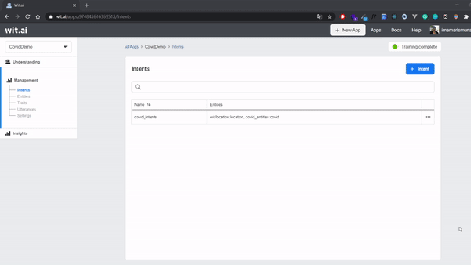
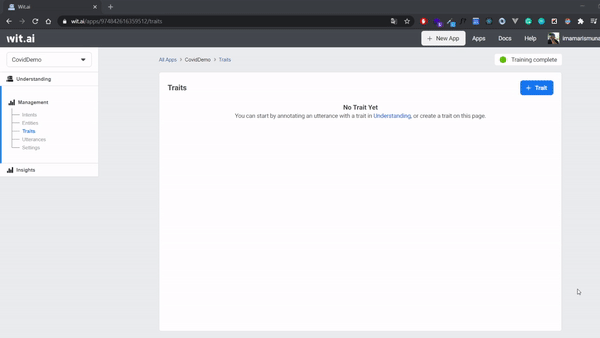
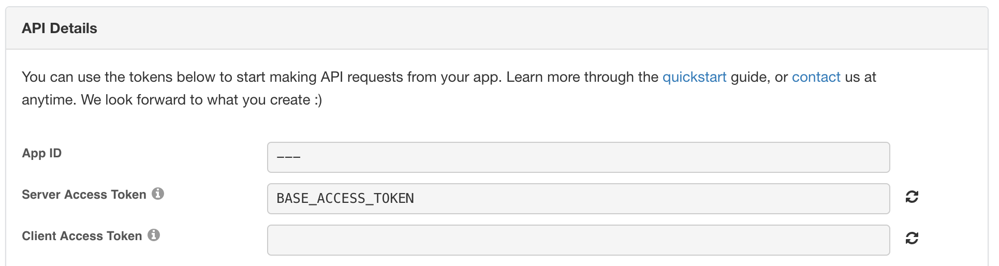
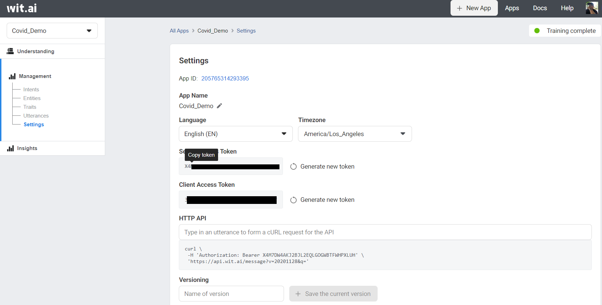
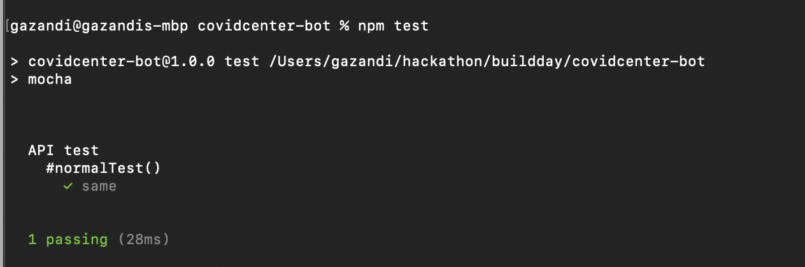

## Create and Train Wit.AI Application to do Natural Language Processing (NLP)

Wit AI has **two method for training the NLP**.
The first is inserting utterances with **web interface**.
The second one is inserting utterances with **API**.

We would like to introduce to you all for two methods. But, because data is supossed to be large,
we emphasize the API method more than Web Interface method in this tutorial.

### Wit AI Web Interface

We are going to create intents to define what the user's utterance for our wit.AI application will understand. On the dashboard click on intents, click **+Intents** to add a new intents.

<p align="center">

</p>

How to produce sentiment

1. Select Understanding from the left nav and add a sentence you want to do sentiment analysis on.
```
This is amazing!
```
2. Click **Add Trait**. Enter the name of the trait, such as "sentiment".
3. Click the value selector to create a value "positive".
4. Validate your sentence.
5. Select **Traits** from the left nav and select the trait you just created.
6. In the values section, add more values such as "negative" and "neutral".
7. Annotate a few more examples to get more accurate results!

<p align="center">

</p>

Update: for English apps, you can use our wit/sentiment built-in! It should already appear in your traits dropdown when you click Add Trait.

Your **"sentiment"** is a trait, which means that it depends on the utterance as a whole (as opposed to a particular word or sequence of words appearing in the sentence). If it is inferred from a keyword or a specific phrase, use an entity instead. Your "sentiment" trait is trained by and for you. The good news is, it will be completely **customized to your case**. The bad news is, you need to provide several examples for each value :).

For more information on this, see the [Quick Start](https://wit.ai/docs/quickstart) guide.

### Wit AI API

Before we implement, we should read [Wit.AI API Documentation](https://wit.ai/docs/http/20200513/) first.

After we understand the API, open the [Wit.ai Covid Center init data script](https://github.com/imamaris/covidcenter-bot/tree/init-data)

Update the `init-data/sentiment.tsv` and add
```tsv
Alhamdulillah    sentiment   positive
Bad News   sentiment   negative
Not Good   sentiment   negative
I am so sad   sentiment   negative
Huhuhuhu   sentiment   negative
```

Get Your Seed Token



In order to start using the Wit.ai API, we need to start with some identification. Make sure you have signed up for [Wit.ai](https://wit.ai) if you haven't already.

Once you have:

1. Go to the `Settings` page of the [Wit console](https://wit.ai/home)
2. Copy the `Server Access Token`



This will be the base token we will use to create other apps. In the code this will be under the variable `NEW_ACCESS_TOKEN`.

Next update `NEW_ACCESS_TOKEN` and `APP_ID` in `shared.js` variable to run the  as follows:

```js
const NEW_ACCESS_TOKEN = '' // TODO: fill this in 
const APP_ID = ''; // TODO: fill this in
```

The script is reading data from tsv and hit [Utterances API](https://wit.ai/docs/http/20200513/#post__utterances_link).
In this script, we use doubletab to enable data with tab and `node fetch` to hit api.
We could change utterances constractor and the map for another needs if we want to train another data.

```js
// read data with `\n` splitting
const data = fs
  .readFileSync(fileName, 'utf-8')
  .split('\n')
  .map((row) => row.split(DOUBLETAB))

// mapping 3 column into construct function
const samples = data.map(([text, trait, value]) => {
  // utterances constractor
  return {
    text: text,
    intent: intentName,
    entities: [],
    traits: [
      {
        trait: trait,
        value: value,
      },
    ],
  }
});

// hit and log the response
validateUtterances(samples).then((res) => console.log(res))

// hit utterances API https://wit.ai/docs/http/20200513/#post__utterances_link
function validateUtterances(samples) {
  console.log(JSON.stringify(samples))
  return fetch(`https://api.wit.ai/utterances?v=${APP_ID}`, {
      method: 'POST',
      headers: {
        Authorization: `Bearer ${NEW_ACCESS_TOKEN}`,
        'Content-Type': 'application/json',
      },
      body: JSON.stringify(samples),
    })
    .then(res => res.json())
}
```

After you understand the pre-script 
Run the file with:
```sh
  node init-data/index.js
```

### Test your Wit.AI App with API

Open the [Wit.ai Covid Center init data script](https://github.com/imamaris/covidcenter-bot/tree/init-data)

Update the `test.tsv` and add
```tsv
Alhamdulillah, many cases recovered    sentiment   positive
Bad news   sentiment   negative
I am not happy   sentiment   negative
I am so sad   sentiment   negative
Huhuhuuhuuuuu   sentiment   negative
```

Run the file with:
```sh
  npm test
```


