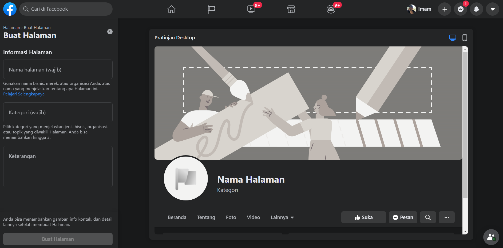
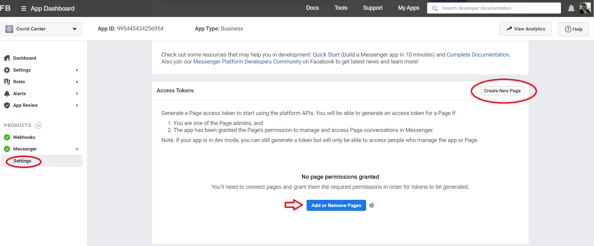
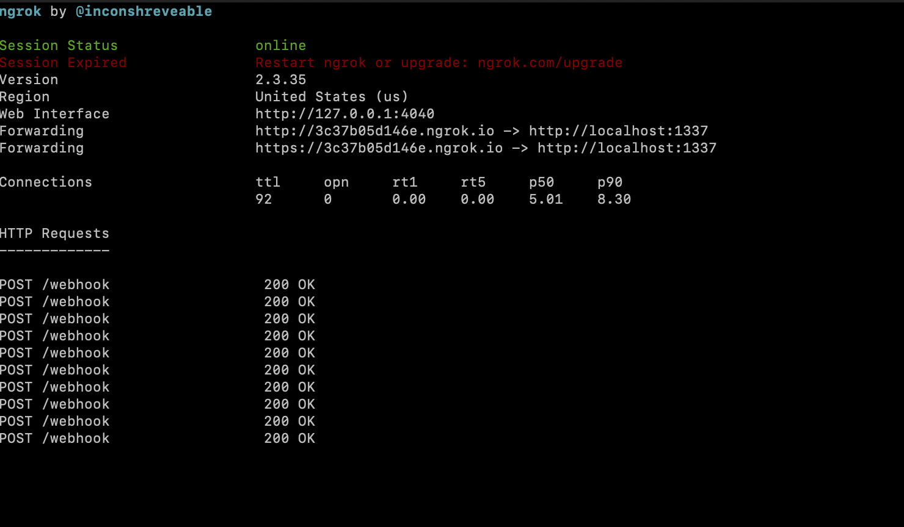
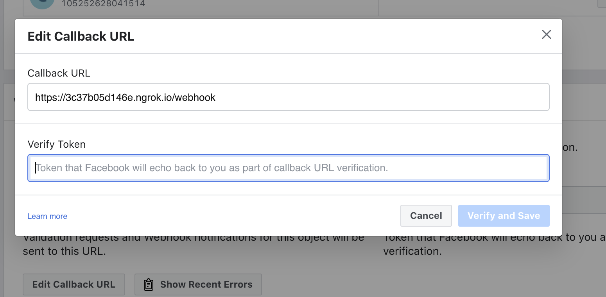
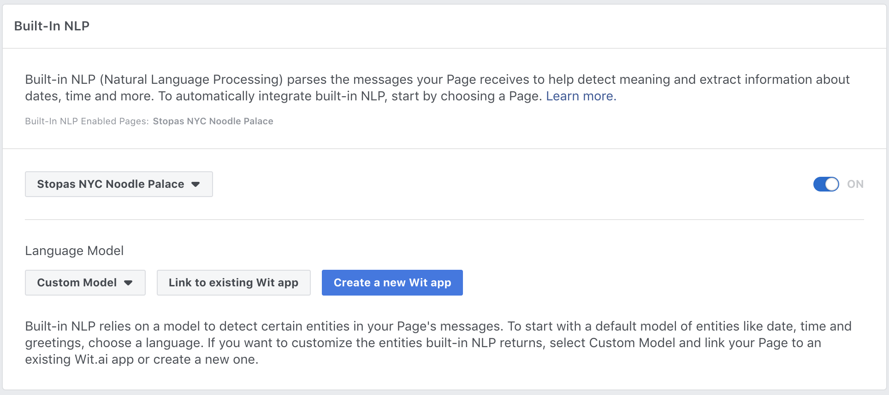
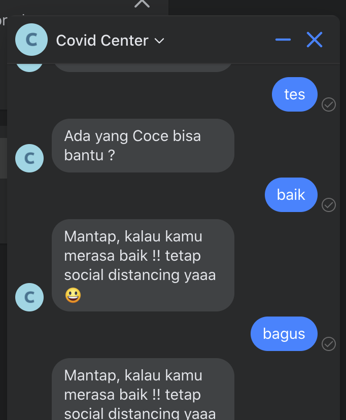

## Integrate Wit.AI with your Messenger Bot

When you download the Tutorial from the [init data branch](https://github.com/imamaris/covidcenter-bot/tree/init-data), the app will be capable of doing text and answer with sentiment intent. In this part, we will add how to retrieve covid 

Before you begin, you will need to create a few things. Please ensure you have all of the following:
- Facebook Page: A Facebook Page will be used as the identity of your Messenger experience. When people chat with your app, they will see the Page name and the Page profile picture. To create a new Page, visit https://www.facebook.com/pages/create




- Facebook Developer Account: Your developer account is required to create new apps, which are the core of any Facebook integration. You can create a new developer account by going to the Facebook Developers website and clicking the 'Get Started' button.
- Facebook App: The Facebook app contains the settings for your Messenger experience, including access tokens. To create a new app, visit your [app dashboard](https://developers.facebook.com/apps).

### Configure App

Add the Messenger Platform to your Facebook app
1. In the sidebar of your app settings under 'PRODUCTS', click '+ Add Product'.
2. Hover over 'Messenger' to display options.
3. Click the 'Set Up' button.
The Messenger Platform will be added to your app, and the Messenger settings console will be displayed.



### Add an webhook to your Messenger bot

Open the [Wit.ai Covid Center bot demo](https://github.com/imamaris/covidcenter-bot/blob/init-data/bot/index.js) int and run

Get `ACCESS_TOKEN` and `VERIFY_TOKEN` from Your App. See [Webhook Setup](https://developers.facebook.com/docs/messenger-platform/getting-started/webhook-setup/) for further reference.

Next update `ACCESS_TOKEN` and `VERIFY_TOKEN` variable to get webhook as follows:

```js
const ACCESS_TOKEN = '' // line 11
let VERIFY_TOKEN = '' // line 74
```

### Test your webhook

Now that you have all the code in place for a basic webhook, it is time to test it by sending a couple sample requests to your webhook running on localhost.

1. Run the following on the command line to start your webhook on localhost:

```sh
node bot/index.js
```

2. From a separate command line prompt, test your webhook verification by substituting your verify token into this cURL request:

```sh
curl -X GET "localhost:1337/webhook?hub.verify_token=<YOUR_VERIFY_TOKEN>&hub.challenge=CHALLENGE_ACCEPTED&hub.mode=subscribe"
```

If your webhook verification is working as expected, you should see the following:
- `WEBHOOK_VERIFIED` logged to the command line where your node process is running.
- `CHALLENGE_ACCEPTED` logged to the command line where you sent the cURL request.

3. Test your webhook by sending this cURL request:
```sh
curl -H "Content-Type: application/json" -X POST "localhost:1337/webhook" -d '{"object": "page", "entry": [{"messaging": [{"message": "TEST_MESSAGE"}]}]}'
```

If your webhook is working as expected, you should see the following:
- `TEST_MESSAGE` logged to the command line where your node process is running.
- `EVENT RECEIVED` logged to the command line where you sent the cURL request.

### Deploy your webhook

[Ngrok](https://ngrok.com) is reverse proxy, it allow you deploy at local with random link.

Download & Install Ngrok | [Link](https://ngrok.com/download)

Run ngrok:

```sh
ngrok http 1337
```



We could access your API from this example is : https://3c37b05d146e.ngrok.io (this is random url from ngrok, you will generate another link)

### Set your webhook and NLP

After we get https webhook url, and working Wit.API, we change our facebook app webhook and connect our working wit api.

Configure the webhook for your app



1. In the 'Webhooks' section of the Messenger settings console, click the 'Setup Webhooks' button.
2. In the 'Callback URL' field, enter the ngrok URL for your webhook. (example: https://3c37b05d146e.ngrok.io)
3. In the 'Verify Token' field, enter the verify token for your webhook. See [Step 4 of Webhook Setup](https://developers.facebook.com/docs/messenger-platform/getting-started/webhook-setup/) for further reference.
4. Click 'Verify and Save' to confirm your callback URL.


The Built-in NLP integration with the Page inbox lets you create a Wit.ai app automatically and bootstrap it with past conversations from your Page directly from the Facebook app console settings. These samples that are compiled into your Wit.ai app are based on real conversations your Page has had with your users.

To try the Built-in NLP Page Inbox feature with your Messenger experience, do the following:



1. In your app settings, go to Messenger > Settings.
2. Enable built-in NLP for your app.
3. In the 'Select a Model' dropdown, select 'Custom'.
4. Click 'Link to existing Wit App'
5. Choose your app
6. Insert your Wit Server Access Token [See how to get Wit Access Token](https://github.com/imamaris/covidcenter-bot/blob/master/README.md#wit-ai-api)

### Try your deployed chatbot

Now, after you set your webhook and NLP, you could try your chatbot.



