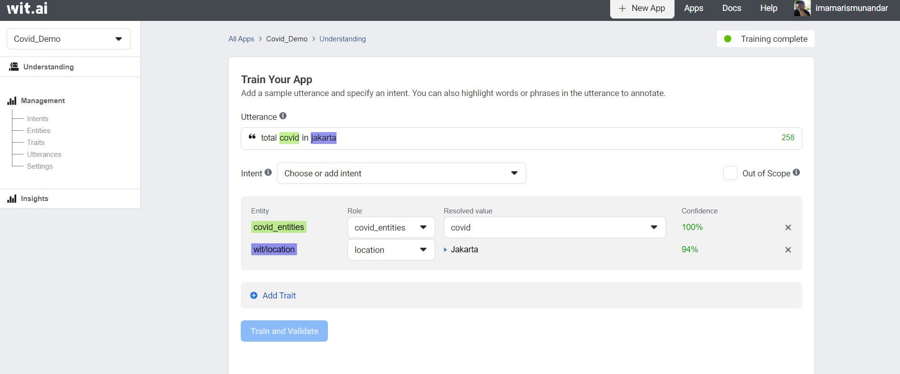

## Learn Terms in Wit.AI

Before we train our Wit app, we should learn about intents, entities, traits, and utterances.
If you already learn those terms, you can go to [Next section](#training-your-wit-app-to-do-natural-language-processing-nlp)

Case Study:
We want to understand what our end-user wants to perform. For example:

- Ask about the weather
- Book a restaurant
- Open the garage door

The problem is that there a millions of different ways to express a given intent. For instance, all the following expressions should be mapped to the same intent:

"What is the weather in Paris?"
"Give me tomorrow weather in Paris."
"Is it sunny or rainy in Paris now?"

**Those expressions are** asking about the **weather intent**. How about entities ? 
**Entities is object that referred in the intent of sentence**.

"What is the weather in **Paris** ?"
Paris is **city** where we ask about the weather for.

"Give me **tomorrow** weather in **Paris**."
Tomorrow is **time** when we ask about the weather for.

"Is it **sunny** or **rainy** in **Paris** **now**?"
And **sunny** and **rainy** are options what we ask about he weather.

**The entities make machine understand what object that related with the intent**.
example: "Give me **tomorrow** weather in **Paris**."

Intent: Ask about the weather , Entities: City: Paris Time: Tomorrow
Machine could query to the database in table weather(intent) with paris city and tomorrow queries (entities)

So what is trait ?
**Trait is tendency of an intent**.
We could give an example of this like sentiment on reaction_intent.

"Sad" (negative)
"OMG :(" (negative)
"I can't believe this. I'm crying" (negative)
"Superb" (positive)

**Utterances is sample data which define a sentence to be categorized to an intent and have entities and traits**.
This term will be used to train data, for example: 

Now that we are understand, let’s train our Wit app to process the user’s response to the app.
