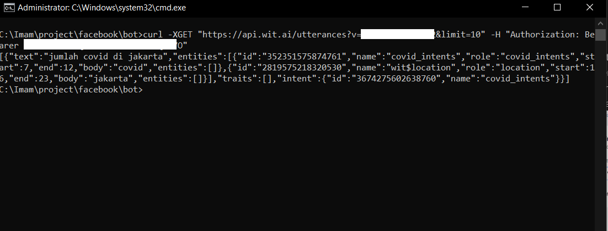

## Train covid_intent with Wit.AI API

We are going to create intents to define what the user's utterances for our wit.AI application will understand. On the dashboard click on intents, click **+Intents** to add a new intents.

<p align="center">

</p>

Next, we create training intents, entities and utterances which the user will likely do on the understanding menu. Add an utterance:

1. Make sure you are in **Train Your App** page by click **Understanding** on top right menu.
2. Input `jumlah covid di jakarta` to **Utterance** text box.
3. Label it your entitites into utterance by highlight `covid` and enter `covid_intents`, click **Create Intents** as a entitites, highlight `jakarta`, and choose `wit/location`.
4.  Submit your first utterance by clicking **Train and Validate**. Training will be start a few seconds  - you can check the status training on top right corner.

<p align="center">

</p>

To find out whether our training has been successful, you can try to re-enter related words to the training that we are doing, namely Covid and Jakarta and make sure the confidence reaches above 90% to test the validity of our intentions.

<p align="center">

</p>

```
$ curl -XGET "https://api.wit.ai/utterances?v=$APPID&limit=10" -H "Authorization: Bearer $YOURTOKEN"
```

<p align="center">

</p>

You may have heard that the most important part of machine learning is data training. At this step, we're only providing our Wit app with a single data point, so let's think about the natural variations the user might respond to and repeat steps # 4 through # 5.

Now We go to the next step: how to input automatically your utterances with large data training. You can check this step:

1. You can clone our github [See how to input Utterance](https://github.com/imamaris/covidcenter-bot/tree/covid-template/init-data)
2. Now you can see file in [Dataset covid intent.tsv](https://github.com/imamaris/covidcenter-bot/tree/covid-template/init-data/datasets), that is file tsv dataset for training our apps. 
3. Update and add your own data
for example, you can see the `init-data/datasets/covid_intent.tsv`

your_covid_intent.tsv
```tsv
rumah sakit rujukan di Bogor   location   23   27
gejala covid    covid   0   6
```
4. Next, we need [init data script](https://github.com/imamaris/covidcenter-bot/tree/covid-template/init-data) for training your data. you can check this script:

init-data/covid_intents.js

covid_intents.js
```js
const fs = require('fs');
const fetch = require('node-fetch');
const { validateUtterances } = require('../shared')

const DOUBLETAB = '   ';
const fileName = 'init-data/covid_intent.tsv'
const intentName = 'covid_intents'
const entityName = 'covid:covid'
const data = fs
  .readFileSync(fileName, 'utf-8')
  .split('\r\n')
  .map((row) => row.split(DOUBLETAB))

const samples = data.map(([text, value, start, end]) => {
  return {
    text: text,
    intent: intentName,
    entities: [
        {
            entity: entityName,
            start: start,
            end: end,
            body: value,
            entities: [],
        }
    ],
    traits: [],
  }
});

validateUtterances(samples).then((res) => console.log(res))
```
we have **text, value, start, and end** that we can check again from our covid_intent.tsv. we can see these terms explanation below:

- **text** is an utterance how the user is likely to chat on Facebook messenger. In our tsv file, the first word of row is the utterance of user messages. ex: "covid di Jaksel"

- **value** is an entity how our application will learn the word that we highlighted. we are training it within the utterance. In covid_intent.tsv, the second word of row is entity. ex: "covid"

- **start** is the starting index highlighted entity within the text. We can see on third column.

- **end** is the ending index highlighted entity within the text. We can see on last column.
